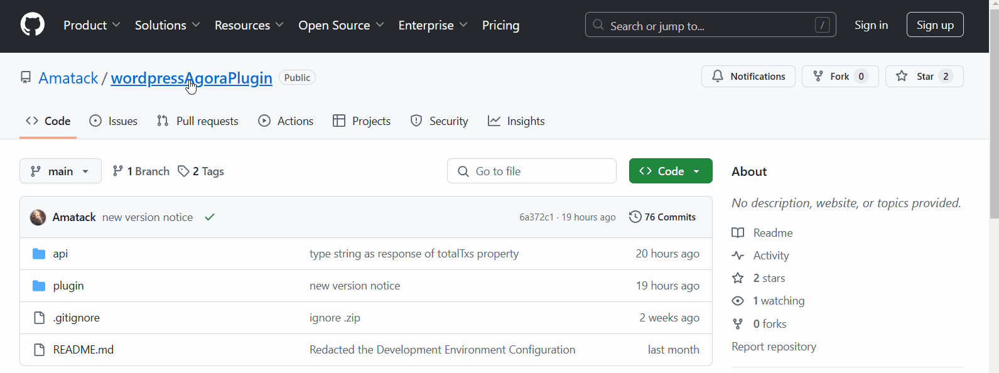
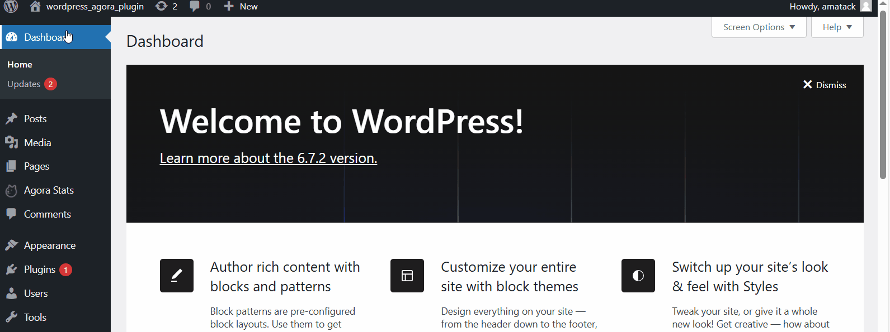
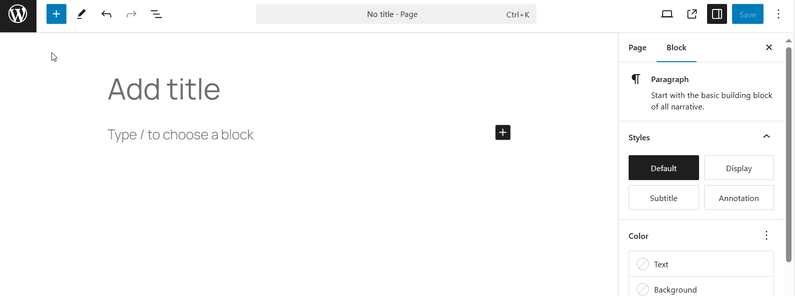

## What is wordpress agora plugin?

This is a plugin that allows you to view and customize the statistics of the token you want from the [eCash](https://e.cash) cryptocurrency ecosystem.

## How to use this plugin on a WordPress site

### Download


1. Go to the GitHub repository: Visit the link https://github.com/Amatack/wordpressAgoraPlugin. (Current page)

2. Navigate to the "Releases" section: Click on the "Releases" tab at the top of the repository.

3. Download the latest version: Find the most recent release and click on the .zip file to download it.
### Upload plugin
1. Log in to your WordPress admin panel.

2. Go to Plugins > Add New.

3. Click the Upload Plugin button at the top.

4. Select the .zip file of the plugin you downloaded from GitHub.

5. Click Install Now, and once the installation is complete, click Activate Plugin.
### Setting up etoken

### Use of Blocks

View available blocks with keyword "agora"
## Shortcodes
### Opening tags
#### [etoken_price_data]
shows values ​​related to the current token price
#### [etoken_supply] 
shows the circulating supply of the etoken
#### [etoken_market_cap]
shows the market cap of the etoken
#### [etoken_total_txs]
shows the total transacctions of the etoken
### Available attribute for [etoken_price_data], 
| Attribute | Description | Posible Values |
|----------|------------|------------------|
| `priceproperty`  | Defines property of current etoken price for the block | `minXecOrder`, `minTokenOrder`, `minPriceInXec`, `minPriceInUsd`

### Available attribute for [etoken_supply], [etoken_market_cap], [etoken_total_txs]
| Attribute | Description | Posible Values |
|----------|------------|------------------|
| `displaymode`  | Allows you to view all the digits or in a simplified way | `complete`, `minimalist` ;

### Available attributes for any tag
| Attribute | Description | Posible Values |
|----------|------------|------------------|
| `textcolor`  | Defines the color of the text | `color name`, `HEX value`, `RGB value`, etc
| `alignment`  | Specifies the horizontal alignment of text in an block. | `left`, `right`, `center`, `justify` , `initial`;
| `backgroundcolor`  | Defines the background color of the block | `color name`, `HEX value`, `RGB value`, etc
| `fontsize`  | Sets the size of a font. | values in `px`, `pt`, `cm`, `mm`, `in`, `%`, `em`, `rem`, `vw`, `vh`, `vmin`, `vmax`;
| `hasborder`  | Sets the border to block. | `true`, `false`;
| `isbold`  | Sets the border to block. | `normal`, `bold`, `bolder`, `lighter`, *number* (100, 200 , etc);
| `borderradius`  | Defines the radius of the block's corners. |  values in `px`, `pt`, `%`, `em`, `rem`;
## Setting Up the Development Environment

Within your WordPress installation, navigate to wp-content/plugins and run the following commands:

```bash
git clone git@github.com:Amatack/wordpressAgoraPlugin.git
cd wordpressAgoraPlugin
```
To install all the necessary dependencies, run the following commands:
```bash
npm run install
```